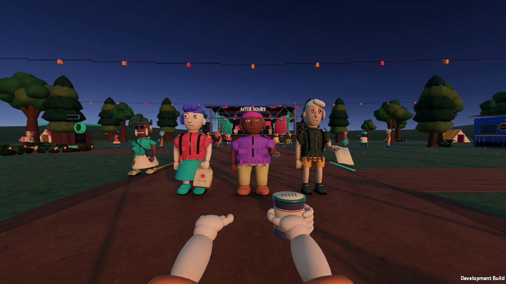
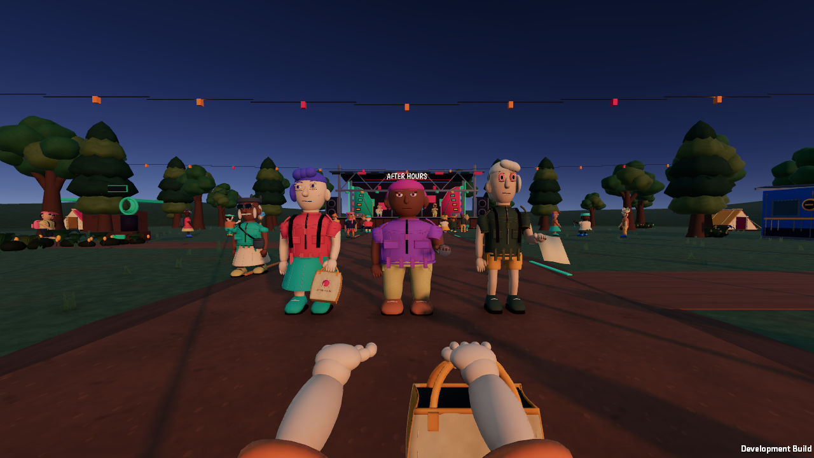
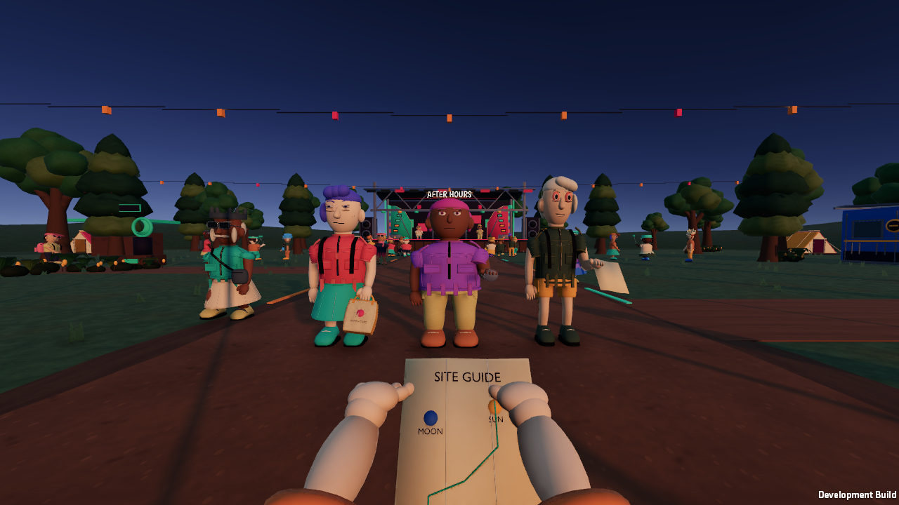
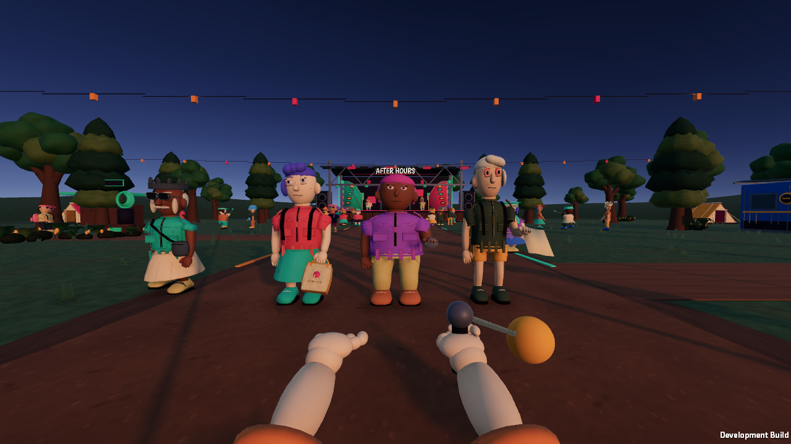

# First-person finger grips — September 28, 2026

## Purpose

Continue the reference-quality interaction goal by replacing the single mitten-like first-person pose with fingers that respond to carried objects. This does not complete the overall goal.

## Implementation

- Original Blender hand geometry now has three segments per finger and an opposing thumb, with separate grip shapes for bag straps, tins, paper and left/right poi handles.
- Shape keys preserve the existing three body shapes and four sleeve choices. The generator asserts the shape set before exporting; the staging manifest validates it.
- Runtime caches imported shape indices and blends pose weights on equipment changes. No network or collision state changes; no per-frame allocation. Grip diagnostics remain editor/development-only.
- Shop-held objects take precedence over equipment. Empty/dead states relax the grip, and performing poi selects both hands.
- Place the first-person tin farther forward so the palm meets its rear wall and the fingers can wrap around its sides.
- Expand native first-person captures to include a poi grip.

## Validation and limits

The first native review exposed the FBX handedness convention: source-right fingers appeared on the camera-left hand. Source labels were corrected, and the regression test now requires movement on the equipped right hand while the empty left hand stays unchanged. Deformation is measured in world metres because the imported FBX has its own scale. The test compares both shapes within one frame, isolating deformation from breathing and imported skin-root motion. Final verification is recorded below.

Third-person character fingers and authored handover/use sequences remain separate unfinished work. First-person poses use shaped geometry, rather than collision-driven finger IK. The full reference-quality target remains active.

## Results

18/18 PlayMode tests passed, including actual baked deformation on the equipped right hand, no deformation on the empty left hand, shop-held paper precedence, and release to rest. Static project validation and Python/JavaScript syntax checks passed.

The final native development build, two-client smoke and connection UI captures passed. Captures were inspected for right-hand contact and an unchanged empty left hand. The source rotation helper was also corrected so relaxed finger segments follow their authored directions.

Final-source PlayMode rerun: **18/18 passed**. The macOS release build and diagnostic-exclusion check passed. Populated native client p95 samples were 17.5 ms at 1280×720 Ultra with two local processes; this is not a minimum-spec or sustained-60-fps claim. The updated development player was reopened through the menu and left at camp.
