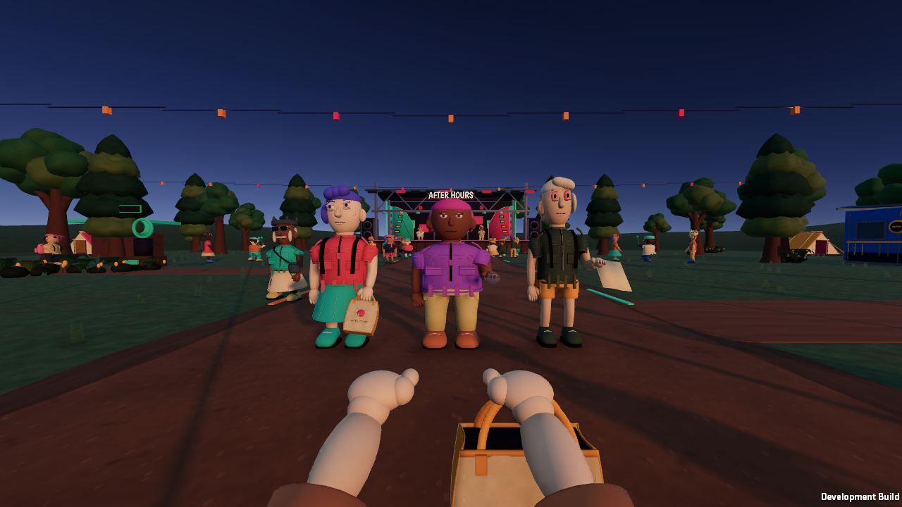
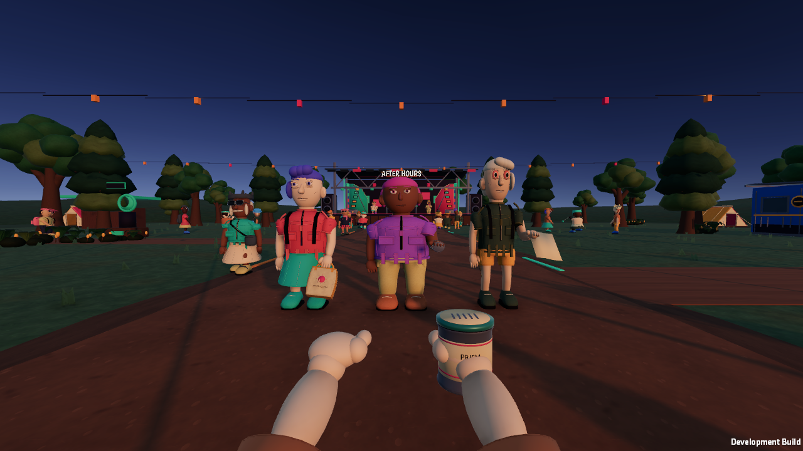
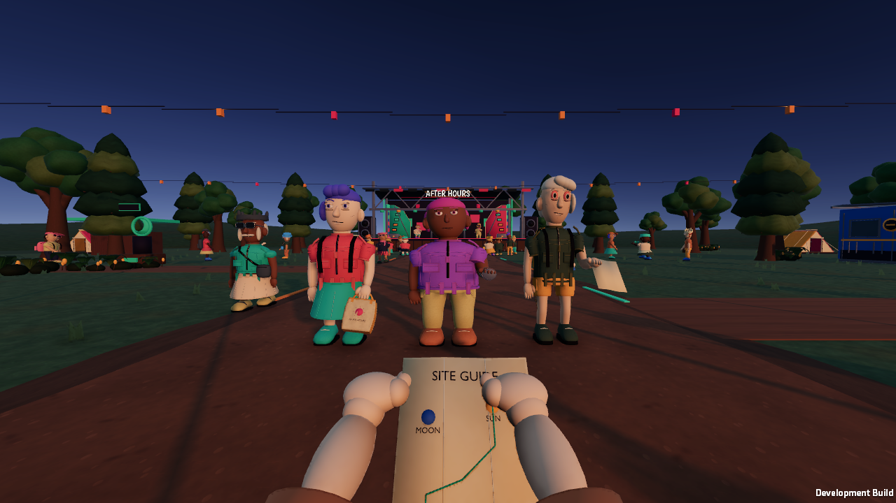
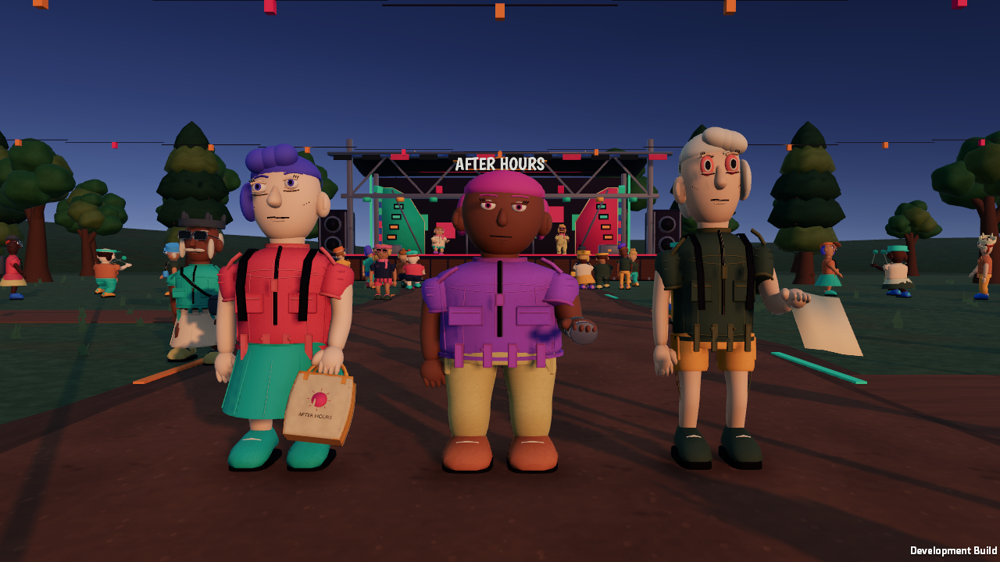

# Close-up gear construction — September 28, 2026

This pass continues the reference-quality goal. It does not accept the overall character, motion, environment or interaction quality target.

## Changes

- Replace the box-shaped merch bag with bowed canvas panels, gussets, an open-top silhouette, reinforced rim, continuous sewn straps and festival printing. The straps converge at the existing palm anchor.
- Replace the plain stock cylinder with a formed metal tin, rolled base, separate lid, lid seal, wrapped label and embossed lid ribs. Printing follows the curved wall and reads upright from either side.
- Replace blank map geometry with three folded paper panels, a route and labeled landmarks. Passes and medical vouchers now have printed faces and paper thickness in the source mesh.
- Remove the runtime paper compression that would flatten the new folds.
- Add a staged gear-only export with manifest completeness validation, backups and preserved Unity metadata. A full world export still includes these recipes.
- Tighten the existing grip test's mesh selection to distinguish the actual Gold straps from CanvasGold trim; retain its physical distance assertion.
- Correct native smoke capture collection so first-person bag/tin/map filenames receive their own captures rather than copies of the third-person gallery.

## Review

The tote was inspected in Blender's solid viewport. Native first-person captures exposed upside-down map printing and the reverse tin label; these drove a second source iteration. Native captures are the acceptance evidence for the imported assets, rather than the Blender preview alone.

## Remaining quality gaps

The fixed finger shapes still need item-specific grasp poses. The tote is static shaped cloth. Character expression and authored motion transitions remain below the reference. Improved props do not establish complete trailer-level visual quality.

## Validation

17/17 PlayMode tests passed, including imported-scale handle contact and first-person attachment motion/visibility. Static project checks, Python compilation and JavaScript syntax checks passed. The final development build, two-client native smoke and connection UI captures passed. The corrected map and tin printing were inspected in the final native first-person captures.

The final macOS release build and release diagnostic-exclusion check passed. The rebuilt development game was reopened through the menu and left running at camp. No reference-quality completion claim is made.
