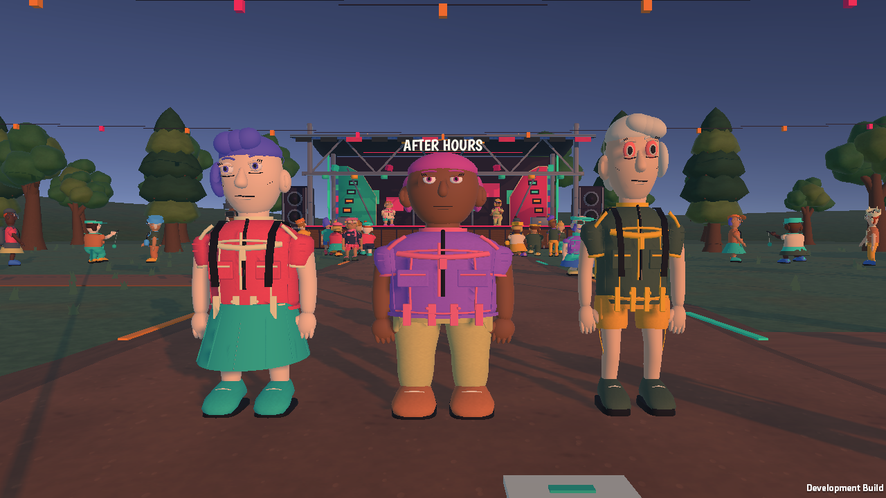
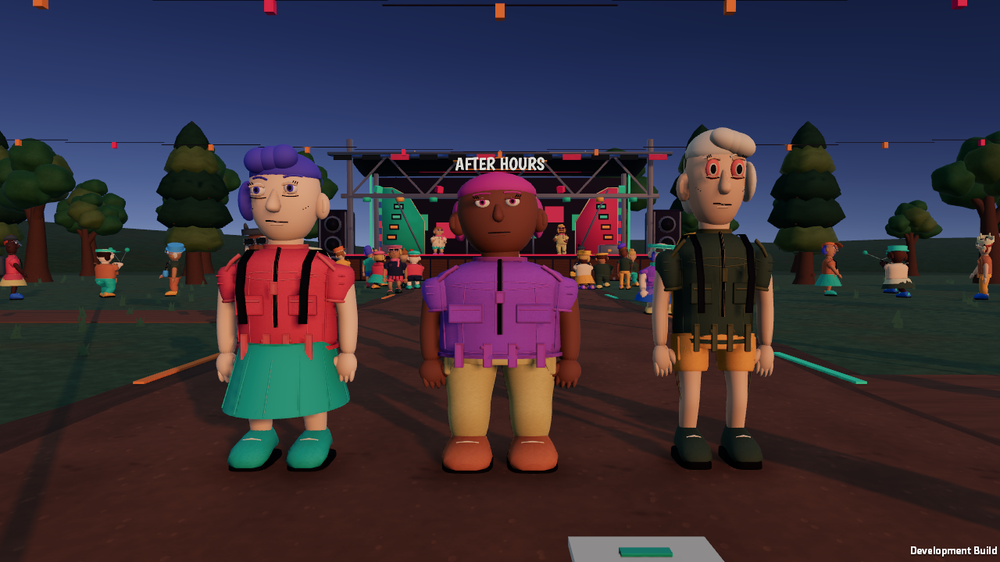
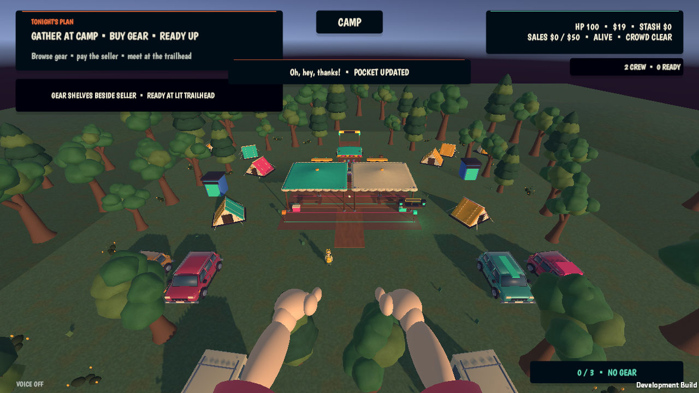
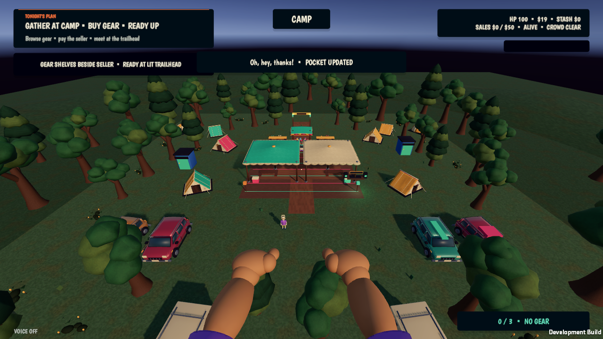

# Rendering and garment pass — September 28, 2026

## Target and result

Compared the running game with the Dear Passengers teaser (https://www.youtube.com/watch?v=luWunttkCgY), including the close character/interior shot around 0:05. The useful reference qualities are smooth silhouettes, clear surface contact, restrained clothing accents and soft directional shading. This pass improves those qualities with original festival assets. It does **not** satisfy the full trailer-quality target or close the graphics plan's M2 acceptance gate.

## Changes

- Persist 4x MSAA, two shadow cascades and soft shadow support in the URP asset; request soft shadows on the active camp/festival key lights.
- Assign the renderer's previously null post-processing resource explicitly. Retain ACES and restrained bloom, with adjusted exposure and contrast.
- Add downsampled, eight-sample ambient occlusion with a 35 m falloff. Include its resources in builds rather than adding the feature after shader stripping.
- Replace flat ambient illumination with sky/equator/ground fill. The first capture was too dark under the pavilion; increase indirect fill and reduce camp key intensity after native review.
- Rebuild garment seams by ray-projecting onto the subdivided garment surface, sampling every 2.5 cm or less and checking every contact. Reduce the cord radius to at most 4 mm. Existing IDs, rig, blend shapes and Unity GUIDs are preserved.
- Give shirts and trousers a tonal fabric palette; vivid role markers and accessories keep their existing palettes. Dispose the additional per-character material and palette with the actor.
- Reduce objective/prompt/stat cards. Correct crew-label padding after a manual launch exposed truncation, and separate the temporary notice from the interaction rail.
- Add build validation for post-processing resources and the single active AO feature. Rendering diagnostics include MSAA, cascade count and ambient mode only in editor/development builds.

## Evidence

- `node scripts/verify-project.mjs`: passed.
- Python generator compilation and staged character generation: passed; all surface-contact ray casts succeeded.
- Unity EditMode: 29/29 passed, including imported rig/LOD/face contracts.
- Unity PlayMode: 15/15 passed.
- macOS development and release builds: passed.
- Two-client native smoke and connection UI capture: passed on the new lighting and rebuilt garments.
- Release diagnostic exclusion: passed.
- Native client populated Playing samples: p95 17.4–17.5 ms at 1280×720 Ultra, two local clients. This is not a locked 60 fps claim or a Windows minimum-spec result.
- Final HUD padding/notice adjustments were manually reviewed after the smoke run.

## Before / after

Before:

After:

Camp overview before:

Camp overview after:

## Still below the reference

Faces retain stiff expressions and simple sculpting; animation still needs stronger anticipation, weight and expressive reactions. The campsite remains spatially repetitive, and several props and ground transitions still read as procedural construction. Those are substantial remaining art and animation tasks. Lighting settings alone cannot close that gap.
