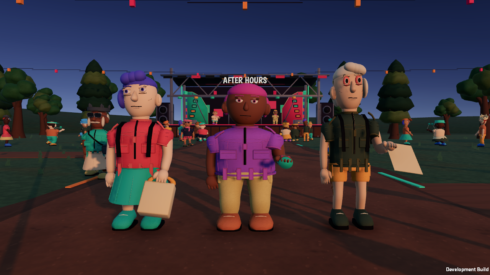

# Held-item contact pass — September 28, 2026

## Scope

Continue the active reference-quality goal through physical object handling. This is progress, not acceptance of the full character-motion, object-quality and interaction objective.

## Changes

- Replace the shared generic hand offset with resource-specific authored grip coordinates, sizes and orientations for bags, tins, confetti, maps, passes, vouchers, wristbands and stash boxes.
- Seat the bag's top handle in the palm and hang its body below it. Keep imported bone scale from magnifying or offsetting props.
- Carry equipped objects with a bent right elbow; use a lower arm for bags. Dedicated performance and interaction poses retain control.
- Reduce handheld paper thickness and tin size after inspecting a native gallery.
- Move first-person item attachments with the same breathing/handoff displacement as the hand meshes, and hide them when the hands are hidden.
- Inherit the parent rendering layer for newly created art and poi. The separately simulated poi head follows later layer changes too. This prevents hidden local-world equipment from appearing beside first-person equipment.
- Show shop-held items on remote characters, taking precedence over previously equipped items.
- Center a 15 cm poi handle in the grip; place its tether at the handle end.
- Keep grip diagnostics confined to editor/development builds.

## Verification

- PlayMode includes imported-scale/actual bag-handle bounds contact, bag dimensions, local-world layer inheritance, first-person attachment motion, and visibility lifecycle checks.
- Native smoke captures a three-character item gallery and first-person bag, tin and map views. These inspect presentation; they do not prove finger articulation or authored object-use animations.
- Final commands and results are recorded after the native review below.

## Remaining quality gaps

The fingers are still fixed meshes rather than item-specific grasp poses. The bag itself is still a simplified rigid asset. Maps and vouchers lack the material flexibility and detailed graphics of finished props. Carrying is improved, but handovers, purchases and item use need contact-aware animation sequences. The full goal remains active.

## Native review and results

PlayMode: **17/17 passed**. Static project validation and JavaScript syntax validation passed. Development build, two-client native smoke and connection UI capture passed. The final native gallery was inspected both in world view and first person. The first gallery drove a second iteration on paper thickness and tin scale. Populated client p95 samples were approximately 17.4–17.5 ms at 1280×720 Ultra with two local processes; no minimum-spec or sustained-60-fps claim is made.

The final macOS release build and release diagnostic-exclusion check also passed.
